# Linux Server Automation

## What Was Done

* In this project, I automated the configuration of a brand-new **Ubuntu** server running as an **EC2 instance** on **AWS**.
* The EC2 instance was configured to allow **SSH** connections by modifying the **security group** of the instance and the **NACL** of the subnet.
* All configurations were done automatically using `Ansible`.
* Created an administrator user and gave it the necessary permissions and groups.
* Ran system **update** & **upgrade** and installed essential packages.
* Applied security configurations to the server such as `firewalld` to allow **SSH** connections.

## Steps

### 1- Preparing the EC2 Instance

* Launching an instance in a public subnet with a public IP address, or preferably an **Elastic IP** to ensure availability when the instance reboots.
* Modifying the ***Inbound*** rules of the created Security Group to allow **SSH** connections from the **Ansible server**, and the ***Outbound*** rules to allow internet traffic for updates.

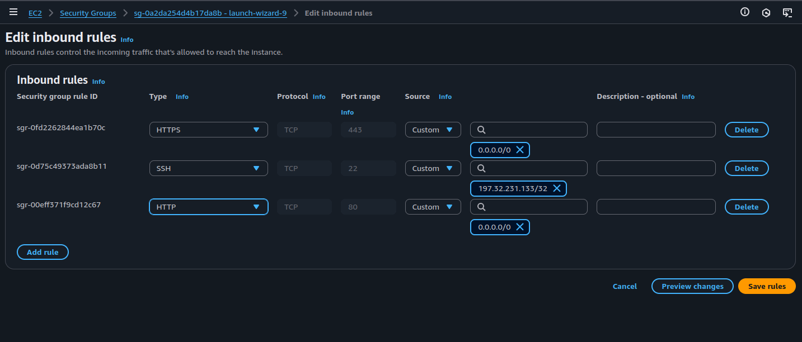
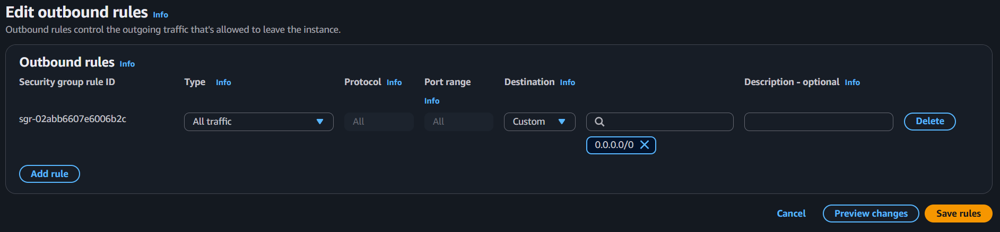

* Creating a NACL and adding the correct ***Inbound*** and ***Outbound*** rules.

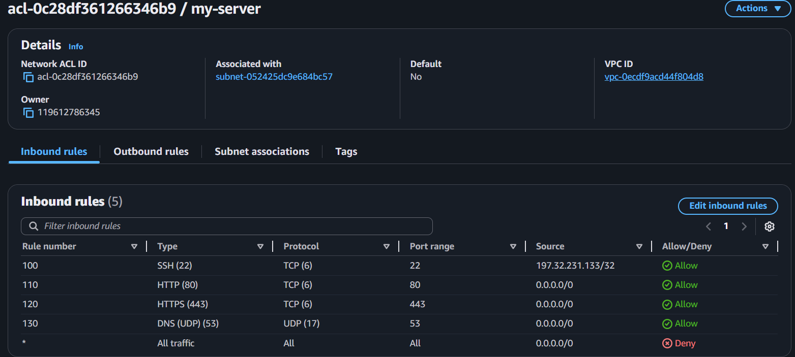
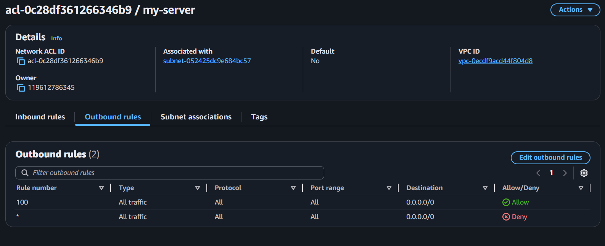

* Testing connection with **SSH** from the local machine using the instance's key pair:

```bash
ssh -i "SAM.pem" ubuntu@ec2-3-90-56-212.compute-1.amazonaws.com
```

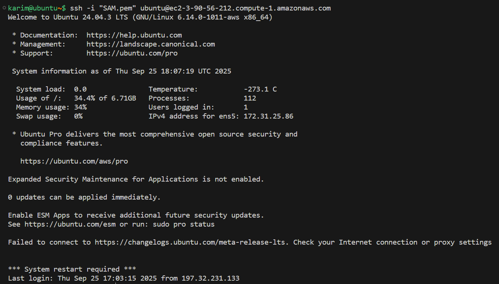

---

### 2- On Local Machine

* **Folder structure:**

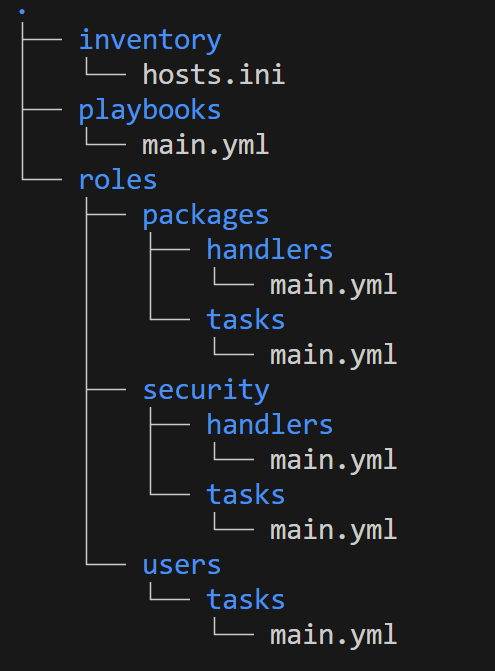

* **inventory/**

  * **hosts.ini** → Lists target servers with connection details.

* **playbooks/**

  * **main.yml** → Main playbook that runs all roles in order.

* **roles/packages/**

  * **handlers/main.yml** → Tasks triggered when package changes occur.
  * **tasks/main.yml** → Updates system, removes unnecessary packages, and installs essentials.

* **roles/security/**

  * **handlers/main.yml** → Tasks for restarting/reloading security services.
  * **tasks/main.yml** → Configures firewall, allows SSH, disables root login, and sets sudo permissions for admin.

* **roles/users/**

  * **tasks/main.yml** → Creates `admin` user, sets up `.ssh` directory, and adds SSH public key.

---

### 3- Testing Connectivity with the Server

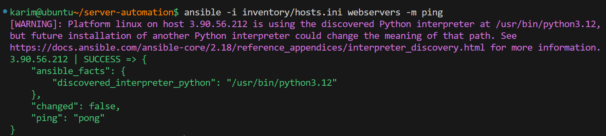

---

### 4- Starting the Playbook

* Start the playbook with the command:

```bash
ansible-playbook -i inventory/hosts.ini playbooks/main.yml
```

⚠️ The working directory must be the project folder `server-automation` for the playbook to run.

* Example output:
  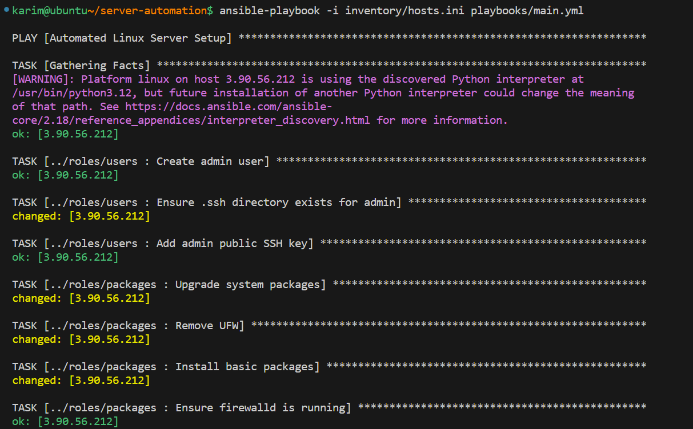
  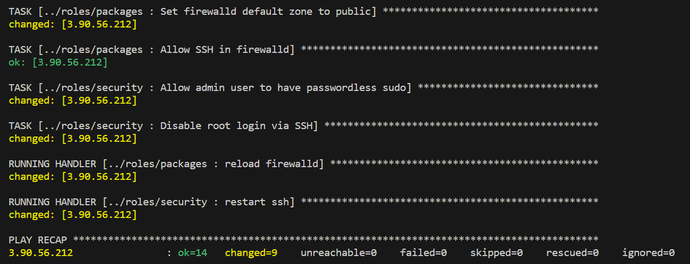

---

### 5- Verifying on the Server Itself

* **Check if `admin` user was created:**

```bash
id admin
```

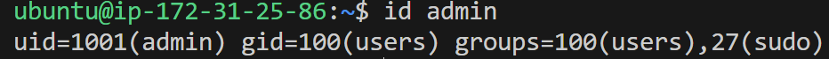

* **Check if packages were installed successfully:**

```bash
which firewalld vim htop curl wget
```

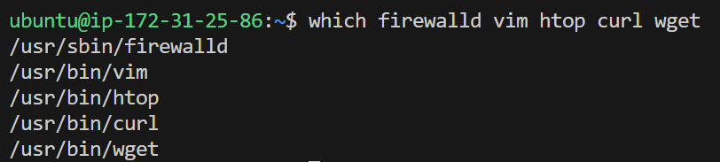

* **Check if `firewalld` service is running:**

```bash
sudo systemctl status firewalld
```

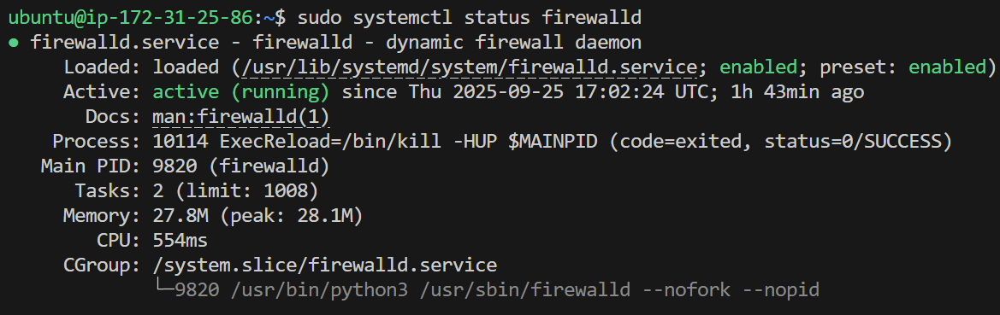

---

**Server is now fully configured, secure, and ready to use. Any future configurations can be automatically applied using the Ansible setup.**

